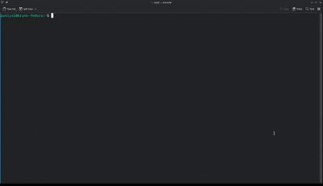

# LazyLeet



**LeetCode-style practice, but local, fast, and terminal-native.**

LazyLeet is what happens when your DSA grind stops living in browser tabs. Browse curated tracks, read local problem statements, write code, run example cases, submit against hidden local tests, and track progress from one clean TUI.

Think **LazyGit for DSA practice**.

## Why LazyLeet

The normal practice loop is way too noisy:

```text
open browser -> search problem -> read prompt -> switch editor -> run locally? -> lose flow
```

LazyLeet keeps the loop tight:

```text
pick problem -> read prompt -> code -> run -> submit -> move on
```

No browser dependency. No internet requirement after setup. No context switching just to stay consistent.

## Highlights

- **Offline-first**: bring your own data packs, then practice without network.
- **Tracks that make sense**: Blind 75, NeetCode 150, and custom packs.
- **Three-pane browsing**: tracks, problems, and details in one terminal view.
- **LeetCode-ish editor flow**: problem on the left, solution and output on the right.
- **Run vs Submit**: run examples quickly, submit against every local testcase.
- **Failed testcase reuse**: promote a failed submit case back into Run for debugging.
- **Local progress**: SQLite-backed status tracking.
- **Local workspace**: solutions live under `~/.lazyleet/workspace`.
- **Resizable panes**: tune the layout once, keep it across restarts.

LazyLeet does **not** ship scraped LeetCode content. Problem statements, metadata, and testcases belong in external data packs that you install separately.

## Quick Start

Run from source:

```bash
go run ./cmd/lazyleet
```

Build:

```bash
go build -o lazyleet ./cmd/lazyleet
```

Check version:

```bash
go run ./cmd/lazyleet version
```

## Controls

```text
j/k             scroll or move selection
tab             switch pane
ctrl+left/right resize panes
ctrl+0          reset pane widths
/               search
e               edit solution
ctrl+r          run examples in editor
ctrl+t          submit all local tests in editor
ctrl+y          use failed submit testcase
ctrl+s          format and save
l               cycle language
m               mark progress
o               open official URL
?               help
q / esc         quit or close
```

## Local Files

LazyLeet stores user state in `~/.lazyleet`:

```text
~/.lazyleet/
  config.toml
  db.sqlite
  packs/
  workspace/
```

- `db.sqlite` stores progress.
- `config.toml` stores layout preferences.
- `workspace/` stores your solutions.
- `packs/` stores external problem data.

Example solution path:

```text
~/.lazyleet/workspace/1971_find-if-path-exists-in-graph/Solution.java
```

## Data Packs

Installed packs use this structure:

```text
~/.lazyleet/packs/<pack-slug>/
  lazyleet-pack.toml
  metadata/
    index.json
    <problem>.json
  tests/
    <problem-test-file>
```

During local development, LazyLeet also reads:

```text
.local/<pack-slug>-metadata/
.local/<pack-slug>/
```

See [docs/data-packs.md](docs/data-packs.md) for the full format.

## Stack

- Go
- Bubble Tea
- Bubbles
- Lip Gloss
- Cobra
- SQLite via `modernc.org/sqlite`

## Status

Early, usable, and moving fast. The core loop is already here: browse, read, edit, run examples, submit local tests, reuse failed cases, save progress, and keep everything offline-friendly.
