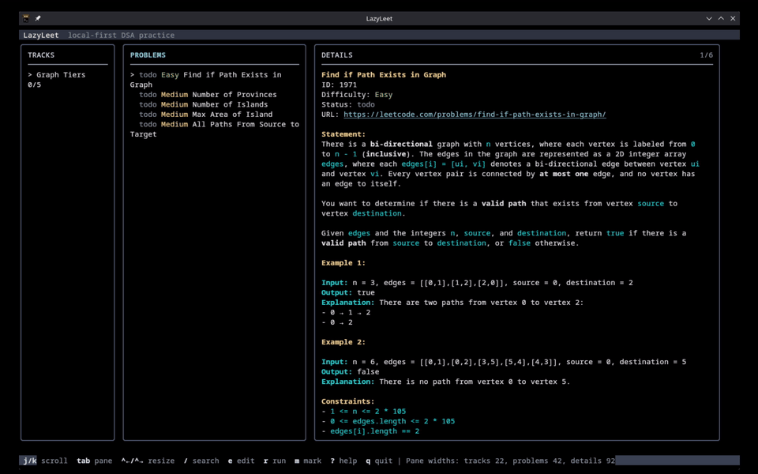
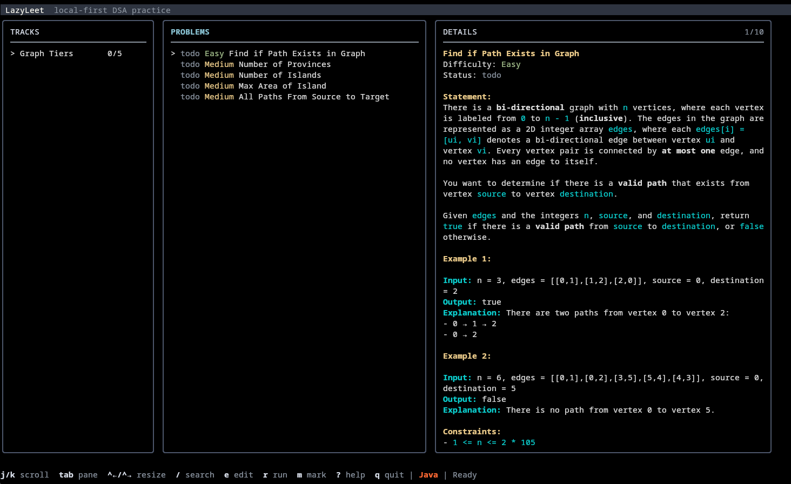
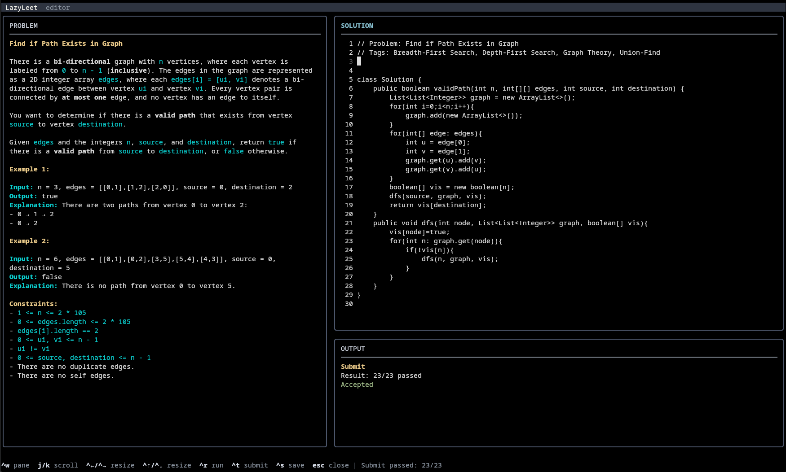

# LazyLeet

<p align="center">
  <strong>Practice LeetCode-style problems from your terminal.</strong>
</p>

<p align="center">
  LazyLeet is a local-first, open-source TUI for browsing problems, reading prompts, writing solutions, running examples, submitting against local tests, and tracking progress without leaving the terminal.
</p>

<p align="center">
  
</p>

## What Is LazyLeet?

LazyLeet started as a terminal-native way to practice DSA problems because working inside CLI tools feels fast, focused, and fun. It brings the practice loop into one app: choose a problem, inspect the statement, edit the solution, run local tests, submit against the available test set, and move on.

It is not a LeetCode replacement, content mirror, or editorial platform. LazyLeet is the local workspace around your practice.

## Preview

<p align="center">
  
</p>

<p align="center">
  
</p>

## Features

| | | |
| --- | --- | --- |
| Terminal workspace | Built-in editor | Local test runner |
| Submit all cases | Failed-case replay | External data packs* |

*Data packs are separate from the core app. We are creating compatible packs so users can install them and start practicing quickly.

## Install

Requires Go 1.26 or newer.

```bash
go install github.com/YalCorp/LazyLeet/cmd/lazyleet@latest
```

Then run:

```bash
lazyleet
```

Check your setup:

```bash
lazyleet doctor
```

For development:

```bash
git clone https://github.com/YalCorp/LazyLeet.git
cd LazyLeet
go run ./cmd/lazyleet
```

## Architecture

LazyLeet is intentionally small and local-first.

| Layer | Responsibility |
| --- | --- |
| TUI | Bubble Tea-based interface for browsing, editing, running, and tracking. |
| Catalog | Loads tracks and problem metadata from built-in and external sources. |
| Workspace | Manages solution files, statement previews, and local test execution. |
| Storage | SQLite-backed progress and preferences. |
| Config | Local layout and app configuration. |
| Data packs | External problem statements, metadata, examples, and tests. |

Local state lives in `~/.lazyleet`:

```text
~/.lazyleet/
  config.toml
  db.sqlite
  packs/
  workspace/
```

## Data Packs*

LazyLeet is data-pack driven. A data pack can provide problem metadata, statements, examples, and local test cases.

Important: LazyLeet does not ship scraped LeetCode content in the app itself. Data packs are separate from the core project. We are working on compatible packs so users can install them and start practicing quickly.

Installed packs use this shape:

```text
~/.lazyleet/packs/<pack-slug>/
  lazyleet-pack.toml
  metadata/
    index.json
    <problem>.json
  tests/
    <problem-test-file>
```

See [docs/data-packs.md](docs/data-packs.md) for the current pack format.

## Tech Stack

| Tech | Used for |
| --- | --- |
| Go | Core app, CLI, local runner, storage integration. |
| Bubble Tea | Terminal application model. |
| Bubbles | Textarea and input components. |
| Lip Gloss | Terminal layout and styling. |
| Cobra | CLI commands. |
| SQLite | Local progress and preference storage through `modernc.org/sqlite`. |

## Contributing

LazyLeet is open source and contributions are welcome. Good areas to help:

| Area | Examples |
| --- | --- |
| Runners | Add or improve language support, timeouts, formatting, and result parsing. |
| TUI | Improve layout, accessibility, keyboard ergonomics, and overflow handling. |
| Data packs | Help design, validate, and document pack formats. |
| Tests | Add coverage for runner behavior, editor flows, and edge-case terminal sizes. |
| Docs | Improve setup, screenshots, data-pack examples, and troubleshooting. |

Before opening a larger PR, start with an issue or discussion so the direction is clear. Small fixes and documentation improvements can go straight to a PR.

## Status

LazyLeet is early, but usable. The core local practice loop is in place, and the project is moving toward better install flows, more language runners, better data-pack support, and a cleaner terminal experience.

## License

LazyLeet is licensed under the [Apache License 2.0](LICENSE).
